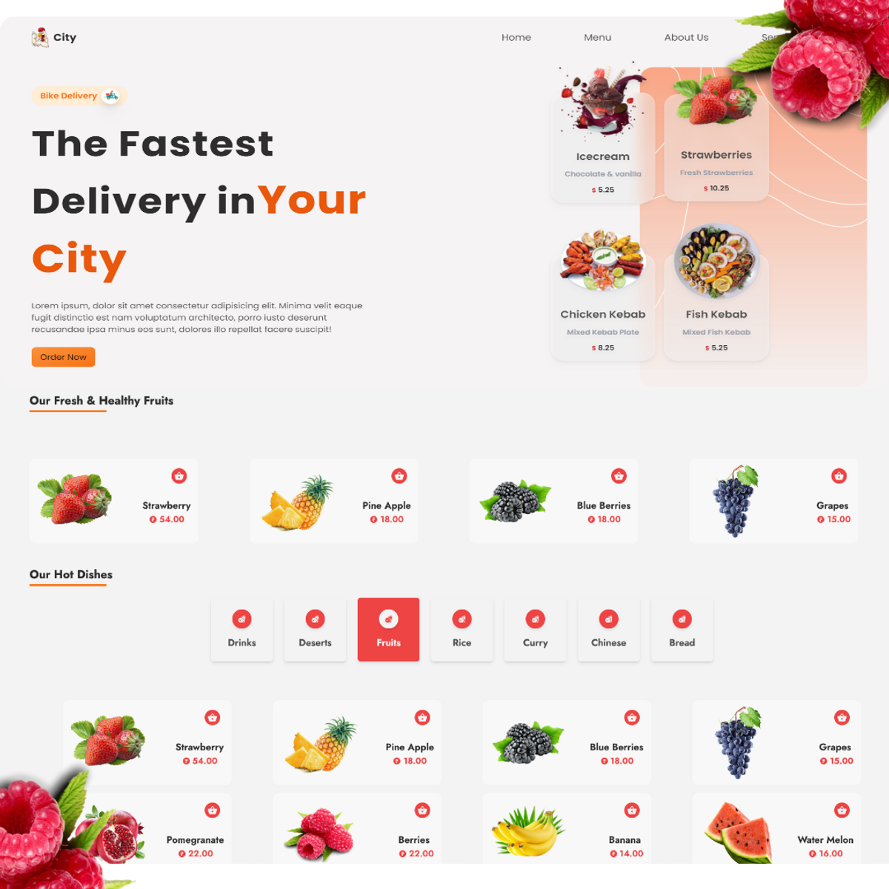

> Fullstack food Delivery Application using Reactjs
> [Follow Us](http://codewithvarsha.web.app) > 

# To check the node version

```
node --version
```

# To start the server

```
npm run serve
```

# To create react project

```
npm create react-app folder_name
```

# To start the client

```
npm start
```

> Packages used
> <--prettier-ignore-->
> | Name | Links | Description |
> |------------------|---------------------|------------------|
> | ReactJs | [React](htttps://reactjs.org/)|React is free & open-source front-end Js Library for building user interfaces based on UI components.|
> | Tailwind CSS | [TailwindCSS](https://tailwindcss.com/)|TailwindCSS is a framework like no other.Ratherthan constraining you to a set design,it gives u the tools & the standardization to build exactly what u want.|
> | Firebase Functions|[Functions](htttps://firebase.google.com/docs/functions)|cloud functions for firebase is a serverLess framework that lets u automatically run backend code in response to events triggered by firebase features.|
> | Express|[Express](https://expressjs.com./)|Express.js, or simply Express, is a backend web application framework for node.js|
> | React Router Dom|[ReactRouterDom](https://reactrouter.com/en/main)|React Router Dom is an npm package that enables u to implement dynamic routing in a web app.|
> | Framer Motion | [FrameMotion](https://www.framer.com/motion/)|A production-ready motion library for react.|
> | React Icons| [ReactIcons](https://react-icons.github.io/react-icons/)|All popular Icons in single package.|
